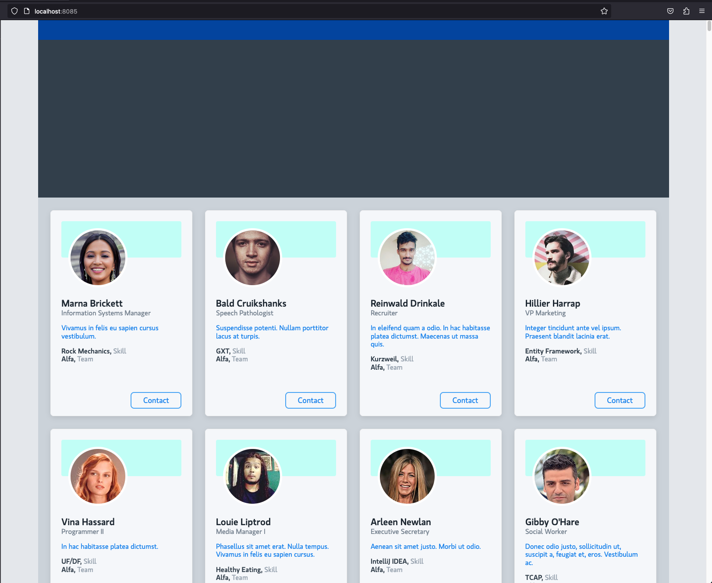

# Frontend Assignment

This assignment tests the following:
* NPM/Webpack frontend production
* HTML development
* ES6 JavaScript
* SCSS/CSS development


The goal of this Assignment is to understand a candidate's approach when assigned a task. 

Questions are encouraged. You should feel free to reach out for assistance in any aspect that does not make sense or that may not be familiar to you.

Candidates are judged on their attention to detail and ability to accomplish the task as efficiently as possible in a team environment, and not primarily on personal proficiency.

<br>

## Assignment Instructions

#### The following page is to be developed using JavaScript and SCSS/CSS. The page contains a Navbar, a Hero box, and a container of Profile Cards.


To page will be completed as follows:
#### Git
* Please do not create a fork of this repository.
* Click the <i>"Use this template"</i> green button on the top right (you need to be logged in to see the button) and duplicate the repository on your own github account.
* Upon completion, you can send the link of your copy of this repository.


#### JavaScript 
All code is to be developed using ES6 JavaScript, starting with the entry file:
```
 src/index.js
```
* No external libraries or packages are allowed.
* The page should peform correctly on both Development and Production environments.
     ##### JSON Data
     * The URL for the json file, <b><i>src/static/data/cards-data.json</i></b>, will be accessed using either <i>import</i> or <i>require</i>.
     * The <i>users</i> array will be returned by calling the JavaScript Fetch API on the json file URL. 
     * The Profile Cards are to be sorted by the <i>"teamName"</i> property and then by <i>"lastName"</i>.
     ##### Thumbnail Images
     * The thumbnails are located in the <i>src/static/imgs/thumbs</i> directory.
     * The thumbnail image src can be accessed by adding the user <i>thumbnail</i> property to the global, <b><i>window._getThumbnailURL</i></b> method.

#### CSS
SCSS is to be used for styles and any scss files should be imported in to: 
```
 src/scss/main.scss
```
* The completed page does not have to be pixel perfect.
* Display flex or grid is to be used for the layout, and floats will not be allowed.
* The layout should be responsive and should collapse to 3, 2 and 1 columns.
* The src/scss/02-variables/fonts.scss contains the Sass font variables that should be used.

<br>

## About this Webpack Project
This is a basic NPM/Webpack project that has the following features:

1. Development and Production environments
2. SASS is integrated in both environments
3. Company Fonts (gloriola and Karla) are loaded

### Webpack Instructions

#### Install
```
npm install
```


#### Development
The following will load the development site to http://localhost:8085/

```
npm start

```

#### Production
The following will add prod files to the dist folder
```
npm run build
```

The following will add prod files to the dist folder and will create a custom assets directory path

```
DAM=content/dam/mydamfolder npm run build
```

